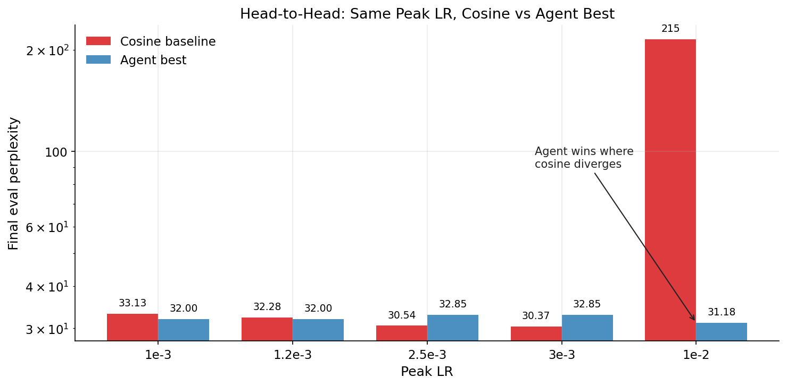
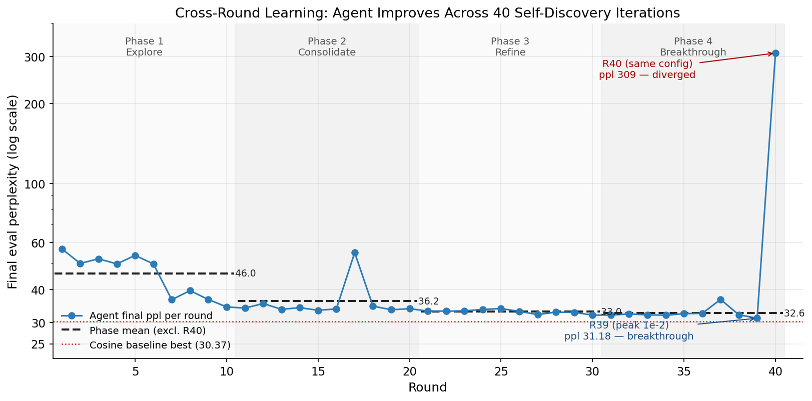
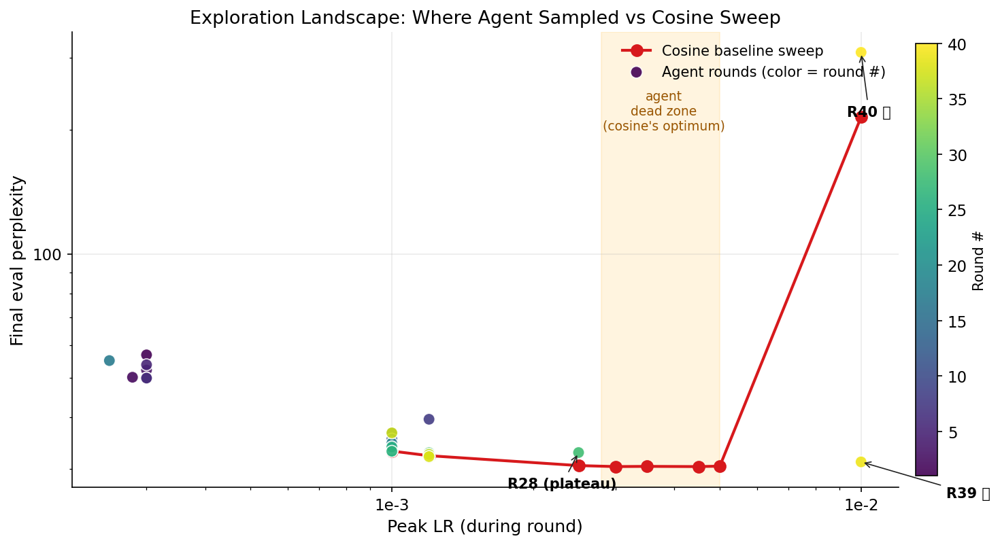
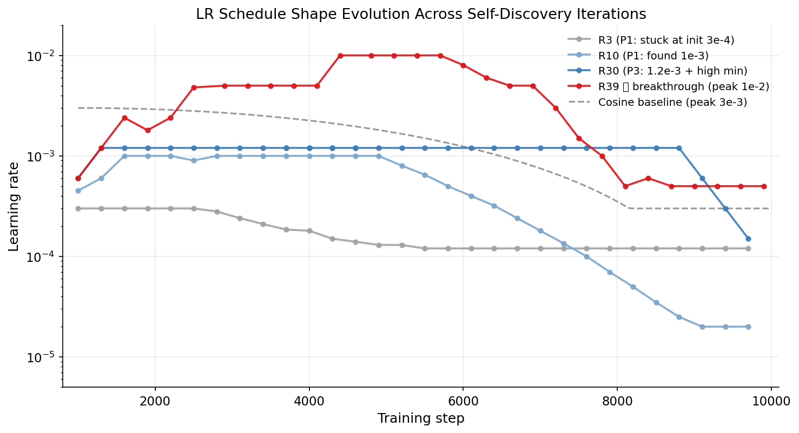

# Agent-D2Z Discovery

**A 2-agent + rule-based safety framework for autonomous learning-rate schedule discovery in LLM pre-training.**

Qwen3.6-Plus drives two cooperating LLM agents — a `Controller` (per-K-step LR decisions) and a `Memory` (cross-round experience replay) — backed by a pure-code `SafetyGuard` (LR jump clamping + crash rollback + NaN detection). The framework self-discovers LR schedules for LLaMA-60M pre-training on C4, without any human-provided LR prior.

---

## Key Finding 🎯

**Agent successfully trained at peak LR = 1e-2 where hand-tuned cosine-decay diverges.**



At peak LR = 1e-2, the agent achieves **ppl 31.18** while cosine-decay diverges to **ppl 215**. The agent's automatically discovered schedule shape (deeper effective decay than cosine's standard `0.1 × peak`) extends the operating envelope beyond the analytical scheduler's convergence boundary.

Across 40 cross-round iterations, the system progressed: mean ppl `46 → 36 → 33 → 32.6` over four 10-round phases.



The framework also reveals failure modes — e.g., R40 catastrophically failed at the *same* configuration that gave R39's breakthrough, exposing the stochasticity inherent to LLM-driven scheduling at boundary LR regions.

See [`docs/日志2_40轮后的发现.md`](docs/日志2_40轮后的发现.md) for the full 40-round analysis (Chinese), including the head-to-head comparison with cosine sweeps and failure-mode characterization.

---

## Architecture

```
─────────────────  ROUND START  ─────────────────
  [Memory Agent]  reads past rounds (jsonl logs)
    → distills strategy brief (≤150 words)
    → injects into Controller prompt

──────────  TRAINING LOOP (every K=300 steps)  ─────────
  step / loss
       ↓
  [Controller Agent]  proposes next LR
       ↓
  [SafetyGuard rule 1]  clamp to [0.5×, 2×] current LR
       ↓
  write lr_command.txt  → main.py applies LR across GPUs

  [SafetyGuard rule 2]  on crash → rollback to healthy ckpt + LR ×0.5
  [SafetyGuard rule 3]  on NaN/Inf → terminate → triggers rule 2

──────────────  ROUND END  ──────────────
  write final_results_log.jsonl + decisions_log.jsonl
  next round's Memory reads them (cross-round learning loop)
```

Full architecture details: [`docs/agent_architecture.md`](docs/agent_architecture.md)

---

## Repository Structure

```
├── agent.py                   # Orchestrator: 2 LLM agents + SafetyGuard rules
├── main.py                    # Training script (torchrun-launched subprocess)
├── pretraining_utils/         # Tokenizer/dataloader/optimizer builders
├── cola_configs/
│   └── llama_60m.json         # LLaMA-60M architecture config
├── scripts/
│   ├── run_30_rounds.sh       # Multi-round agent campaign launcher
│   ├── run_cosine_baseline.sh # Cosine LR sweep (no agent)
│   └── clean_run.sh           # Per-round state reset
├── docs/
│   ├── agent_architecture.md  # Architecture diagram + role table
│   ├── 日志1_2Agents_30轮的发现.md   # Experiment log: rounds 1-30
│   └── 日志2_40轮后的发现.md          # Experiment log: rounds 31-40 + baselines
└── experiments/               # (optional) compact experiment data
    ├── final_results_log_agent_60m.jsonl
    ├── decisions_log_agent_60m.jsonl
    ├── rollback_log_agent_60m.jsonl
    └── cosine_baselines/
```

---

## Quickstart

### 1. Set up environment

```bash
# Create a conda env (or use venv)
conda create -n agent-d2z python=3.10
conda activate agent-d2z

# Install dependencies
pip install -r requirements.txt
```

### 2. Configure credentials

```bash
# Copy the template and fill in your real keys
cp .env.example .env
# Edit .env with your DashScope, wandb, HF tokens

# Load env vars in your shell
set -a && source .env && set +a
```

You need:
- `DASHSCOPE_API_KEY` — for Qwen3.6-Plus agent calls ([get one](https://dashscope.console.aliyuncs.com/))
- `WANDB_API_KEY` — for run logging ([get one](https://wandb.ai/authorize))
- `HF_TOKEN` — for C4 dataset download

### 3. Run a 10-round agent campaign

```bash
DEVICE="0,1,2,3" RUN_TAG=my_first_run \
  bash scripts/run_30_rounds.sh 10
```

This will:
- Launch 10 rounds sequentially (one fresh agent.py process per round)
- Each round = 10,000 update steps of LLaMA-60M on C4 (≈ 1.2B tokens)
- Memory accumulates across rounds via three jsonl logs
- Results appear in `final_results_log_my_first_run.jsonl`

### 4. (Optional) Compare against cosine baseline

```bash
DEVICE="0,1,2,3" LRS="1e-3 3e-3 5e-3 1e-2" \
  bash scripts/run_cosine_baseline.sh
```

Runs cosine-decay baselines at each peak LR (no agent involved).

---

## Configuration

**Fixed config (in `agent.py` top):**

| Constant | Value | Meaning |
|---|---|---|
| `LR_INIT` | 3e-4 | LR target at end of warmup |
| `WARMUP_STEPS` | 1000 | Fixed linear warmup |
| `DECISION_EVERY` | 300 (env `K`) | Controller decision frequency |
| `LR_JUMP_LOW / HIGH` | 0.5 / 2.0 | SafetyGuard per-step LR clamp |
| `TOTAL_STEPS` | 10000 | Per-round training length |
| `MAX_CROSS_RUN_HISTORY` | 10 | Memory's sliding window size |

**Agent model selection (in `AGENT_MODELS` dict):**
- `controller`: high-frequency, low-latency tier (default: `qwen3.6-plus-2026-04-02`)
- `memory`: low-frequency, strong-reasoning tier (default: same)

---

## Experimental Results

40 cross-round agent iterations + 7 cosine baselines on LLaMA-60M / C4 / 10000 steps:

| Setup | Best ppl | Notes |
|---|---|---|
| **Agent (40 rounds, best = R39)** | **31.18** | peak 1e-2, min 5e-4 (self-discovered shape) |
| Cosine baseline (peak sweep best) | 30.37 | peak 3e-3 or 4.5e-3 |
| Cosine baseline at peak 1e-2 | 215.08 | diverged (training instability) |

**Head-to-head at the same peak LR:**

| peak LR | Cosine | Agent best | Winner |
|---|---|---|---|
| 1e-3 | 33.13 | 33.85 | cosine (marginal) |
| 1.2e-3 | 32.28 | 32.00 | agent (marginal) |
| 2.5e-3 | 30.54 | 32.85 | cosine (attribution failure case — see docs) |
| 3e-3 | 30.37 | — | cosine (agent never explored; "dead zone") |
| 1e-2 | 215.08 💥 | **31.18 / 309.08** | agent (stochastic, 1/2 success rate) |

The agent's value is not in beating cosine on its best peak, but in **extending the safe operating range of LR scheduling** to regions where analytical methods fail.

### Exploration Landscape



Each colored dot is one agent round (color = round number). The red curve is the cosine baseline sweep. **The shaded "dead zone" (3e-3 to 5e-3, cosine's optimum region) was never explored by the agent** — a consequence of Memory attribution error after R28's single failed attempt at 2.5e-3 (see docs).

### LR Schedule Shape Evolution



The agent's LR schedules evolved from conservative (R3: stuck at init 3e-4) through plateau-discovery (R10: found 1e-3) to the eventual breakthrough shape (R39: peak 1e-2 with deeper-than-cosine decay). Note the agent's discovered shapes systematically differ from the standard cosine reference.

See [`docs/日志2_40轮后的发现.md`](docs/日志2_40轮后的发现.md) for failure-mode analysis (Memory attribution errors, plateau-rule self-suppression, etc.).

---

## Known Limitations

- **Attribution failure** in Memory: when a configuration with multiple dimensions (peak / shape / min_lr) fails, Memory misattributes failure to the wrong dimension, permanently excluding good regions (R28 case study).
- **Plateau rule fires only once** in 40 rounds (at R28), and the failure data from that single firing self-suppresses subsequent activations.
- **High variance at LR boundary**: R39 (31.18) and R40 (309.08) used essentially the same config but had opposite outcomes.
- **40 rounds × ~38 min/round ≈ 25h** vs cosine sweep ~5h — slower for known tasks.

---

## Citation

This work was conducted as a research project. If you reference this codebase or the experimental findings, please cite:

```bibtex
@misc{agent_d2z_discovery_2026,
  title  = {Agent-D2Z Discovery: A 2-Agent Framework for Autonomous LR Schedule Discovery in LLM Pre-training},
  author = {Your Name},
  year   = {2026},
  url    = {https://github.com/<your-username>/agent-d2z-discovery}
}
```

---

## License

This project is released under the MIT License — see [`LICENSE`](LICENSE) for details.

The training infrastructure (`main.py`, `pretraining_utils/`) is adapted from the [CoLA](https://github.com/alvin-zyl/CoLA) codebase.

---

## Acknowledgments

- Built with [Qwen3.6-Plus](https://help.aliyun.com/zh/dashscope/) (DashScope API) as the agent backbone.
- Training infrastructure builds on [CoLA](https://github.com/alvin-zyl/CoLA).
- Dataset: [`allenai/c4`](https://huggingface.co/datasets/allenai/c4).
